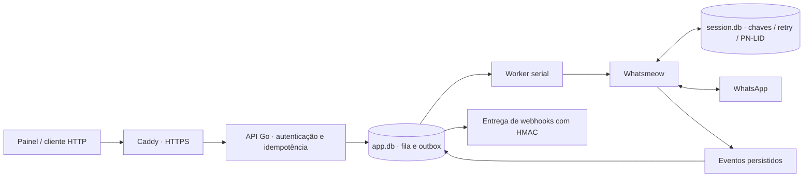

# Arquitetura e decisões

Uma instalação, um processo proprietário, um número e um volume local. SQLite evita uma dependência de rede adicional para esta operação pessoal. WAL melhora a disponibilidade de leitura; synchronous FULL prioriza durabilidade, sujeito às garantias reais do filesystem e hardware. O lock de processo é obrigatório. Não use SQLite sobre NFS nem replique o container app.

## Estados de mensagem

`queued → sending → sent → delivered → read`

Também existem `failed` (falha antes do envio ou prazo expirado), `cancelled` (cancelada ainda na fila) e `uncertain` (operação de envio sem resultado conclusivo). `sending` encontrado no startup vira `uncertain`: o processo anterior pode ter transmitido antes de cair. Recebimentos de entrega/leitura podem resolver esse estado. Recibos tardios nunca rebaixam `read` para `delivered` ou `sent`.

O ID é persistido antes do envio e passado a SendMessage. A API exige Idempotency-Key e vincula a chave ao hash do payload; repetição do mesmo pedido devolve o ID anterior. Conteúdo diferente retorna 409. Nenhum mecanismo local garante transação atômica com o servidor remoto. Os retries criptográficos internos do protocolo são distintos de criar uma nova mensagem na fila.

Um upload de arquivo ocorre em Prepare antes de Send. Falha nessa etapa marca failed; a aplicação não enviou uma mensagem no chat. Após iniciar Send, qualquer erro é tratado conservadoramente como uncertain, mesmo quando sua causa poderia ser inofensiva. Isso troca automação de reenvio por menor risco de duplicação.

## Sessão

Whatsmeow gerencia o protocolo e as chaves; o aplicativo usa o SQL store oficial da biblioteca. `UseRetryMessageStore=true` preserva mensagens necessárias ao mecanismo de retry, e `EnableDecryptedEventBuffer` com confirmação síncrona permite guardar eventos recebidos antes de confirmar seu processamento. O handler retorna false se a persistência falhar. Não se promete entrega exactly-once de todos os eventos nativos.

Há um único controlador de reconexão. O dial tem prazo, mas o contexto de uma conexão bem-sucedida dura até a desconexão ou encerramento do serviço, sem depender da requisição HTTP. O loop usa espera exponencial com jitter e teto de cinco minutos. Logout, conflito ou cliente desatualizado acionam pausa persistente. O pareamento pós-login interno da biblioteca permanece habilitado.

## Dados e retenção

app.db guarda payloads cifrados com AES-GCM; a limpeza horária remove conteúdo antigo de mensagens concluídas, preservando registros mínimos e hashes de idempotência. Mensagens incertas e eventos dead/pending são mantidos para investigação, portanto exigem acompanhamento de espaço em disco. Identificadores, números e timestamps são metadados em claro. Arquivos locais não são servidos pelo servidor estático.

session.db contém material sensível em claro, incluindo o retry store nativo com política própria de aproximadamente sete dias. RETENTION_DAYS não altera essa política nem garante remoção segura dos bytes antigos do SQLite/WAL/backups. Use proteção do disco e backup cifrado. Leia SECURITY.md.

## Webhooks

Atualizações da fila e seus eventos são gravados na mesma transação. Cada evento tem ID e sequência persistentes. Uma única rotina tenta entregar eventos pendentes, com timeout, backoff e até dez tentativas. Após isso, delivery=dead. O operador pode reprocessar pelo painel ou API. Sem WEBHOOK_URL, os eventos são locais (disabled) e não são retroativamente enviados ao configurar um receptor.

A entrega é pelo menos uma vez sob condições operacionais normais até o limite de tentativas; um timeout do receptor pode ocasionar repetição. O receptor precisa deduplicar o ID e tolerar eventos fora de ordem: um evento posterior pode ser entregue enquanto um anterior aguarda nova tentativa. Persistir eventos sem espaço em disco pode falhar, e não há disponibilidade garantida durante esse incidente.

## Capacidade e disponibilidade

Esta entrega não inclui cluster ou failover automático entre hosts. Um failover incorreto com sessões ativas dos dois lados pode piorar a estabilidade. Priorize backup consistente, restauração testada e manutenção deliberada. CPU/RAM, latência, proporção de uncertain e frequência de desconexões precisam ser medidos no seu tráfego antes de definir um SLO.
